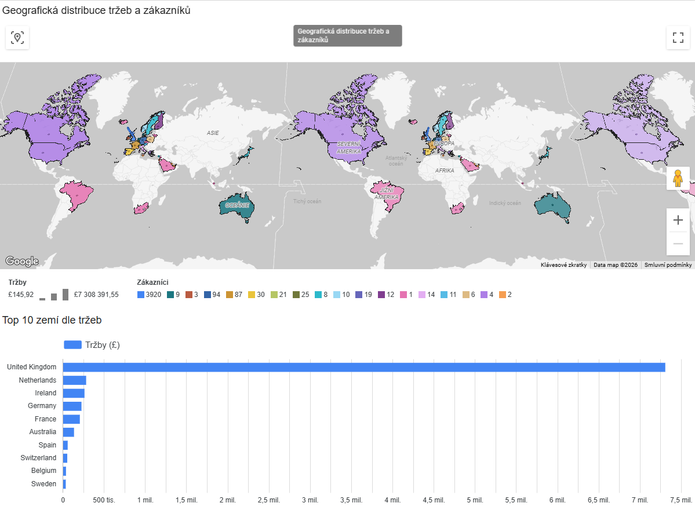
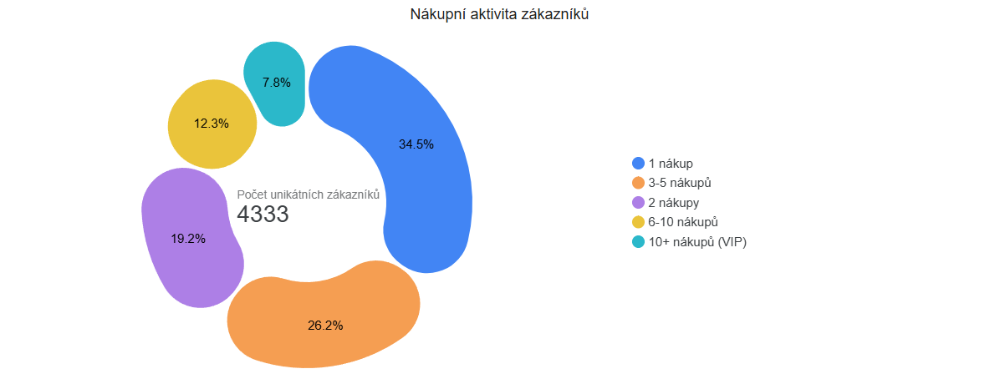
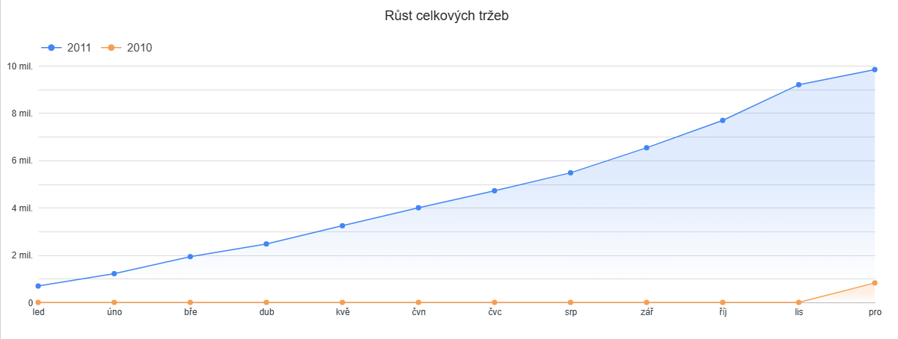
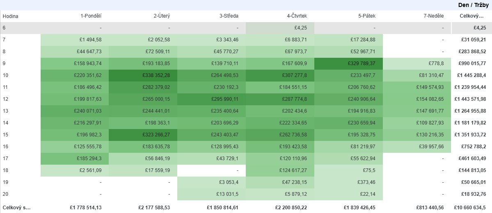
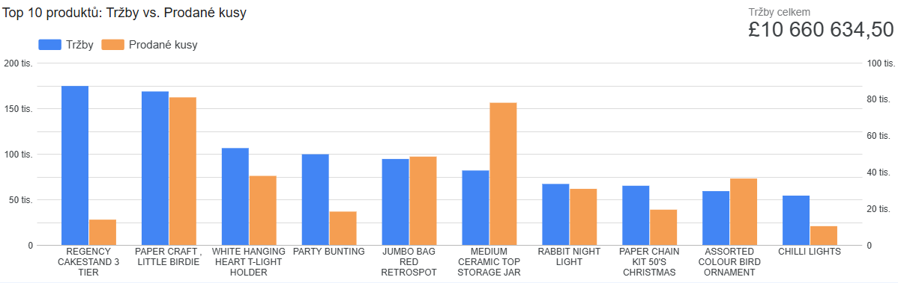

# 📊 E-commerce Data Analysis Pipeline

Tento projekt představuje kompletní end-to-end řešení pro zpracování a analýzu e-commerce dat. Pokrývá cestu od čištění syrových dat v **Pythonu**, přes pokročilé dotazování v **Google BigQuery (SQL)**, až po finální vizualizaci obchodních výsledků.

Odkaz na projekt v Looker Studio: https://lookerstudio.google.com/s/tYQLUUnzpng

## 🛠️ Použité technologie
* **Python (Pandas):** Čištění dat a ETL proces.
* **SQL (Google BigQuery):** Komplexní analýza a agregace dat.
* **Google Looker Studio:** Tvorba interaktivního dashboardu a vizualizací.

---

## 📂 Struktura projektu

### 1. Data & Čištění (`clean.py`)
Skript transformuje surová data z `data.csv` (veřejný dataset) do čisté podoby:
* **Očištění:** Odstranění stornovaných objednávek (faktury začínající na 'C'), sjednocení hodnot, ošetření chybějících customerID.
* **Validace:** Odstranění záporných hodnot množství a ceny.
* **Doplnění dat:** Automatické mapování chybějících názvů produktů podle `StockCode`.
* **Feature Engineering:** Vytvoření sloupců pro časovou analýzu (`Year`, `Month`, `DayOfWeek`, `Hour`) a celkovou sumu (`TotalSum`).
* **Nahrání databáze:** Vytvoření databáze a nahrání do BigQuery na základě zadaných údajů.

### 2. SQL Analýza (Složka SQL dotazů)
* `revenue_trend.sql`: Sleduje měsíční vývoj obratu.
* `top_product.sql`: Identifikuje 10 nejprodávanějších produktů podle tržeb.
* `country_revenue.sql`: Agreguje tržby a počet unikátních zákazníků podle zemí.
* `sales_timestamp.sql`: Analyzuje prodeje podle hodin a dnů v týdnu.
* `customer_activity.sql`: Ukazuje nákupní aktivitu zákazníků - kolik se jich vrácí zpět k nákupu

---

## 📈 Vizualizace a Business Insights

Na základě analýzy byly vytvořeny následující vizualizace (viz `Ecommerce_Analytika.pdf`):

### 🌍 Geografická distribuce a jejich tržby
* **Hlavní zjištění:** Dominantním trhem je **United Kingdom** s tržbami přes **7,3 mil. £**.
* **Expanze:** Významný podíl na trhu mají také Nizozemsko, Irsko, Německo a Francie. Mapa potvrzuje globální zásah e-shopu do více než 35 zemí.
  

### 👥 Nákupní aktivita zákazníků
* Graf ukazuje rozdělení zákazníků do segmentů podle počtu provedených nákupů.
* Na základě počtu zákazníků v jednotlivých segmentech lze vidět, jak velká část zákazníků nakoupila pouze jednou a kolik z nich realizovalo opakované nákupy.

### 📉 Růst firmy od jejich vzniku
* Graf zobrazuje vývoj měsíčních tržeb v čase a umožňuje sledovat celkový trend výkonnosti firmy
* Z výsledků je patrný postupný růst tržeb v průběhu analyzovaného období.

  
### 📅 Časová analýza (Kontingenční tabulka s teplotní mapou)
* Graf zobrazuje tržby podle dne v týdnu a hodiny nákupu. Intenzita barvy zvýrazňuje období s nejvyšší nákupní aktivitou, což umožňuje rychle identifikovat časové špičky v chování zákazníků.
* **Denní aktivita:** Nejsilnější prodejní okno je mezi **10:00 a 15:00**. Nejsilnějším dnem v týdnu je **čtvrtek**. Naopak v sobotu je aktivita nulová (pravděpodobně zavřeno).

### 🏆 Produktová výkonnost
* Graf **Top 10 produktů** ukazuje, že nejvýnosnějším artiklem je *"REGENCY CAKESTAND 3 TIER"*.
* Analýza pomáhá identifikovat klíčové produkty, které generují většinu marže, a odlišit je od nízkoobrátkového zboží.
  

---

## 🚀 Jak projekt použít
1.  Nainstalujte potřebné knihovny: `pip install pandas pandas-gbq`
2.  Spusťte čistící skript: `python clean.py`
3.  Nahrajte výsledný dataset do Google BigQuery.
4.  Pro hlubší analýzu spusťte přiložené SQL skripty.

---
*Analýza vytvořena jako ukázka zpracování e-commerce dat v cloudovém prostředí.*
